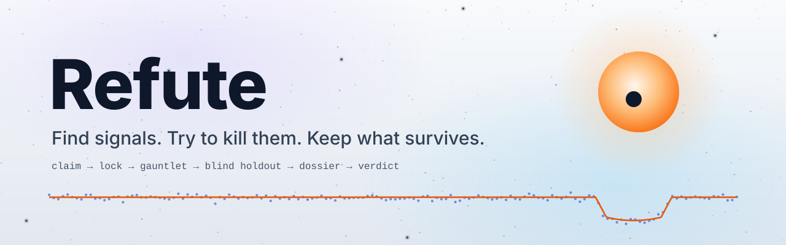
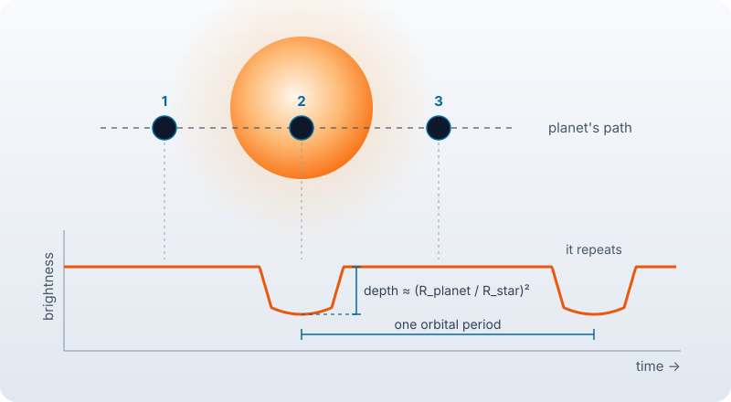
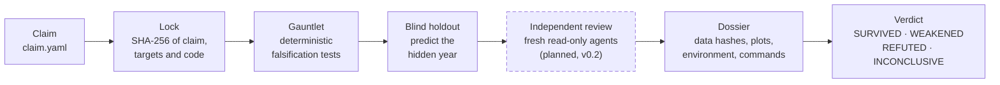

<p align="center">
  <picture>
    <source media="(prefers-color-scheme: dark)" srcset="docs/assets/banner-dark.svg">
    <source media="(prefers-color-scheme: light)" srcset="docs/assets/banner-light.svg">
    
  </picture>
</p>

<p align="center">
  <a href="https://github.com/klucilla/refute/actions/workflows/ci.yml"></a>
  <a href="LICENSE"></a>
  <a href="pyproject.toml"></a>
  <a href="ROADMAP.md"></a>
  <a href="CONTRIBUTING.md"></a>
</p>

<p align="center">
  <b>Refute is an open-source framework that attacks scientific claims before anyone believes them,<br>
  whether the claim is a new discovery or a published result. Agents propose; deterministic tests decide.</b>
</p>

> [!IMPORTANT]
> **Status: v0.1 in development.** Nothing here is a confirmed discovery. Refute produces
> candidates and verdicts, never certainties.

## Why

AI agents can now download data, write analysis code, fit models and make plots in hours.
That is powerful, and dangerous: an agent that wants to find something usually finds it.

Refute flips the question. Instead of asking *"is this real?"*, it throws every attack it
has at the claim, trying to prove that it is **not**: deterministic falsification tests and
a blind holdout today, independent reviewer agents from v0.2. Only claims that survive are
worth a human's attention.

**Agents propose. Deterministic tests decide.** No LLM output is ever the final verdict.
Verdicts come only from deterministic, versioned, reproducible code.

## What Refute is, and what it is not

| Refute is | Refute is not |
|---|---|
| A **falsification engine**: it attacks a claim instead of confirming it. | A discovery machine. It produces candidates and verdicts, never confirmed discoveries. |
| **Pre-registration with teeth**: the claim, its targets and the code are hashed before any hidden data is seen. Any later edit is `TAMPERED`. | An AI oracle. No language-model output ever decides a verdict. |
| **Reproducible**: every verdict ships in a dossier with data hashes, plots, the environment and the commands to rerun it. | A submission bot. Refute never submits anything to a scientific body; any submission is made by a human. |
| **Domain-agnostic**: the engine knows no science; domain packs do. | A judge of people. Verdicts are about claims, never about their authors. |
| **Honest about its limits**: a failed self-claim is published, not tuned away. | A volunteer computing network, yet. Refute@Home is planned for v0.7. |

## The idea in 30 seconds

<p align="center">
  <picture>
    <source media="(prefers-color-scheme: dark)" srcset="docs/assets/transit-dark.svg">
    
  </picture>
</p>

When a planet passes in front of its star, the star dims slightly. That is a **transit**.
NASA's TESS satellite measures the brightness of much of the sky, and the data are public.
A real planet makes the dip repeat at regular intervals, with a consistent depth and duration.

Many things can imitate that dip: two stars eclipsing each other, a neighbouring star
leaking into the aperture, instrument systematics, plain noise. Refute's job is to throw
those explanations at a signal and see whether it survives. In v0.1 it tests for eclipsing
binaries (odd/even depths, secondary eclipse, implausible size) and for noise (signal-to-noise,
blind holdout). Nearby-star contamination and instrument systematics are **not** tested
until v0.2 ([known limitations](docs/gauntlet-tess-v0.1.md#known-limitations-of-v01-addressed-from-v02)).

The sharpest attack is the **blind holdout**. Hide an entire year of observations. Fit the
orbit using only the other years. Predict when the transits should appear in the hidden
year, each with an uncertainty window, then read the hidden year **only** inside those
windows, their local baselines and control windows at the opposite phase. A real periodic
signal passes. Noise rarely does.

## How a claim moves through Refute



<sub>Dashed box: planned, not built yet. In the code, the blind holdout runs as the last
gauntlet test, and the verdict is computed before the dossier is written.</sub>

<details>
<summary><b>The steps in detail</b></summary>

1. **Claim spec.** The hypothesis, data sources, test plan and pass/fail criteria are
   written to `claim.yaml` ([spec](docs/claim-spec.md)).
2. **Lock.** The resolved claim, its attachments and the source tree are hashed (SHA-256)
   and recorded in an append-only history (append-only by convention; its git history is the
   evidence) **before** the data are analyzed. Editing any of
   them afterwards makes `refute verify` return `TAMPERED` ([lock format](docs/lock-format.md)).
3. **Gauntlet.** Domain-specific falsification tests written as deterministic code. For
   TESS v0.1: signal-to-noise, odd/even depths, secondary eclipse, physical plausibility
   ([gauntlet](docs/gauntlet-tess-v0.1.md)).
4. **Blind holdout.** Each observing year is hidden in turn and must be predicted from the
   others. The code that reads the hidden year can only open the predicted windows, their
   local baseline bands and the phase-0.5 control windows.
5. **Independent review** *(planned, v0.2)*. Fresh, read-only agent sessions receive only
   the dossier and try to refute it. Their reports are stored in the dossier. They can raise
   objections; they never set the verdict.
6. **Dossier and verdict.** Every file is hashed in a manifest, and the dossier contains the
   commands that reproduce it ([dossier](docs/dossier.md), [verdicts](docs/verdicts.md)).

</details>

## Two modes, one engine

| Mode | What it does | Status |
|---|---|---|
| `refute replicate` | Re-derives a **published claim** from public data, then attacks it. | Implemented for TESS transits and tested on synthetic data; first real runs come with the v0.1 calibration. Papers in v0.3. |
| `refute discover` | Searches public data for **new signals**, then attacks them. | Planned (v0.4). |

Same engine, same rigor. A discovery is just a claim nobody has tried to refute yet.
A third command, `refute calibrate`, runs Refute's own self-claim (below). It is
implemented and runs once the self-claim is locked.

## Verdicts

| Claim type | Possible verdicts |
|---|---|
| Discovery claims | `SURVIVED` · `WEAKENED` · `REFUTED` · `INCONCLUSIVE` |
| Paper claims (from v0.3) | `REPRODUCED` · `FRAGILE` · `NOT_REPRODUCED` · `NOT_REPRODUCIBLE` |

There is no `TRUE`. How test results combine into a verdict: [docs/verdicts.md](docs/verdicts.md).

## Refute tests itself first

Before Refute is trusted with anything new, it has to recover what is already known. v0.1
starts with a claim about Refute itself, which must be locked before the first calibration
run (status below):

> *Refute recovers at least 9 of 10 known TESS planets (period within 0.1% of the
> published value), flags at least 2 of 3 known false positives, and gives the
> verdict `REFUTED` to at most 1 of the 10 known planets.*

The last condition stops a gauntlet that refutes everything from passing. The result is
published below, pass or fail. If it fails, we publish the post-mortem. One development
target, excluded from the claim, may be analyzed before the lock to find crashes and I/O
errors, as the protocol allows; thresholds are never changed because of it.

### Calibration scope (v0.1)

The calibration targets are drawn by a seeded procedure written down before selection
([calibration/PROTOCOL.md](calibration/PROTOCOL.md)) from an **easy regime**: orbital
periods of 0.5 to 10 days, transit depths of at least 1000 ppm, TESS magnitude 12 or
brighter, single-planet systems, and SPOC 2-minute data in at least two calendar years
spanning at least 300 days. The result of the self-claim says nothing about longer periods,
shallower transits, fainter stars, multi-planet systems or other data products.

### Calibration results

<!-- CALIBRATION:START -->
**Self-claim result: FAIL.** At least one criterion failed.

| Criterion | Value | Requirement | Passed |
|---|---|---|---|
| recovered planets | 10 of 10 | >= 9 | yes |
| flagged false positives | 0 of 3 | >= 2 | no |
| refuted planets (degeneracy guard) | 1 of 10 | <= 1 | yes |

Run `20261007T221214Z-5701c54c` from commit [`821b0d791c81`](https://github.com/klucilla/refute/commit/821b0d791c81d0c3c61d333d93b286b78321dba3) (2026-10-07T22:15:02+00:00). [summary](calibration/results/20261007T221214Z-5701c54c/summary.md) · [run log](calibration/results/20261007T221214Z-5701c54c/RUNS.md) · [post-mortem](calibration/POSTMORTEM.md) · dossier archive SHA-256 `6f67781dbd3790cae767ff215bb0d7ee5cfed0763112304a3b318a3e987c993d`

| Item | Value |
|---|---|
| Claim | [`calibration/self_claim.yaml`](calibration/self_claim.yaml) |
| Claim SHA-256 | `5701c54cb088f1d33895f73d98244d0ea214ddb3f861340d8261b817e189a53f` |
| Code SHA-256 | `624f5f900334abcdc614a679a3fdc4ce9c9e8a465f2d3e553d71b24c199f4cfa` |
| Locked from commit | [`5214f2e29de9`](https://github.com/klucilla/refute/commit/5214f2e29de98803aafff3094733ca424ae3dbde) |
| Locked at (UTC) | 2026-10-07T21:42:15Z |
| `refute verify` | PASS |
| Evidence | [lock file](calibration/self_claim.lock.json) · [lock history](calibration/LOCK_HISTORY.md) |
<!-- CALIBRATION:END -->

## Quickstart

Refute uses [uv](https://docs.astral.sh/uv/) and Python 3.12+ (CI tests 3.12 and 3.13).

```bash
git clone https://github.com/klucilla/refute.git
cd refute
uv sync --frozen                                 # install exactly what uv.lock pins
uv run pytest                                    # synthetic data only, never the network
uv run refute packs                              # installed domain packs
uv run refute verify calibration/self_claim.yaml # FAIL until the self-claim is locked,
                                                 # then PASS (exit 2 means TAMPERED)
```

<details>
<summary><b>Run the calibration, check a dossier</b></summary>

```bash
# Needs the locked self-claim (refute verify must return PASS). Downloads public TESS
# light curves from MAST into .cache/ and analyzes every calibration target in
# parallel (CPU count - 2 workers by default).
uv run refute calibrate --out dossiers

# Verify a dossier's manifest, or compare a re-run with the original.
uv run refute check-dossier dossiers/<run_id>/TIC-<id>
uv run refute check-dossier repro/repro/TIC-<id> --against dossiers/<run_id>/TIC-<id>

# Deterministic zip of a run, with its SHA-256.
uv run refute archive dossiers/<run_id>
```

Every dossier contains a `REPRODUCE.md` with the exact commands for that target. All
commands are documented in [docs/cli.md](docs/cli.md).

</details>

## Domain packs

The engine knows nothing about any science. Each pack implements five attack pieces (a
**data adapter**, a **search**, a **gauntlet**, a **holdout strategy** and an **exporter**)
plus a claim schema, an analyzer and a calibrator ([interface](src/refute/core/pack.py)).
Packs are discovered through Python entry points, so they can live in their own repositories.

| Pack | What it attacks | Status |
|---|---|---|
| Exoplanet transits (TESS) | Transit signals in SPOC 2-minute light curves |  v0.1 calibration |
| Full TESS false-positive battery | Centroids, apertures, aliases, known binaries |  v0.2 |
| Paper replication (ML) | Published results with public code and data |  v0.3 |
| Variable stars (TESS) | Eclipsing binaries and pulsating stars |  v0.5 |
| Mathematics | Conjectures, by verifiable counterexample search |  v0.6 |
| Your field | Anything with public data and falsifiable claims |  pack SDK in v1.0 |

## Refute@Home

> [!NOTE]
> **Planned for v0.7. None of this exists yet.** Today everything runs on your own machine.

Searching years of public survey data for signals, and then attacking every one of them,
is the kind of work that volunteer computing made possible for projects such as
SETI@home and Einstein@Home. The plan for Refute@Home
([scope and exit criteria](ROADMAP.md#v07-refutehome-swarm)):

- **Work units** handed out by a lightweight coordinator to volunteer machines, each unit
  computed by **two independent workers** whose results must agree, with signed results.
- **CPU and GPU workers**, with GPU-accelerated search where it actually pays off.
- **AI-assisted triage** to prioritize what humans look at. It never decides a verdict.
- An honest evaluation of **BOINC**, the open-source platform behind SETI@home and
  Einstein@Home, against a small custom coordinator.

## Roadmap

| Phase | Focus | Status |
|---|---|---|
| **v0.1 Calibration** | Replicate published TESS planets, blind holdout, dossiers |  |
| v0.2 Gauntlet | Full false-positive battery, independent reviewers |  |
| v0.3 Replicate papers | ML papers with public code and data, right of reply |  |
| v0.4 Discover | New candidates in TESS data |  |
| v0.5 Variable stars | Same TESS data, new science |  |
| v0.6 Mathematics | Counterexample search |  |
| v0.7 Refute@Home | Volunteer computing with double verification |  |
| v1.0 Stable | Stable spec, pack SDK, community packs |  |

One phase at a time: a phase closes only with evidence and an independent review ([ROADMAP.md](ROADMAP.md)).

## Contributing

Refute exists to attack claims, so contributions that find weaknesses in Refute itself are as welcome as new features.

- **Attacks on Refute**, any time: lock bypasses, holdout leaks, verdicts that should not
  survive. Open an issue, or report security problems privately ([SECURITY.md](SECURITY.md)).
- **Reproduction.** Once the v0.1 calibration dossiers are published, rerun them on your
  machine and report any difference.
- **Gauntlet tests** for the current phase, each with a synthetic case that passes and one
  that fails. Tests never touch the network.
- **Ideas for later phases**: new domain packs, new attacks, computation. Open an issue to
  discuss them now; pull requests for future-phase work wait for that phase. Community
  packs arrive with the pack SDK (v1.0); volunteer computing is planned for v0.7.

Start with [CONTRIBUTING.md](CONTRIBUTING.md) and [ROADMAP.md](ROADMAP.md): work happens only on the current phase.

## Code of conduct for verdicts

- Verdicts are about **claims, never about authors**. "Not reproduced" does not mean misconduct.
- Before a negative result on a paper is published, its authors get a **right of reply**
  (paper replication starts in v0.3).
- Refute **never submits** anything to scientific bodies. Any submission is made by a human.
- Out of scope: medical or diagnostic claims, and dual-use biology or chemistry.

Community participation follows the [Contributor Covenant](CODE_OF_CONDUCT.md).

## FAQ

<details>
<summary><b>Does Refute discover planets?</b></summary>

No. In v0.1 Refute only re-examines planets and false positives that are already known, to measure
how well its attacks work. Candidate search starts in v0.4, and even then a signal that survives is
only a **candidate**: confirming a planet takes follow-up observations and expert vetting. Refute can
prepare a sheet that helps a person submit a community candidate to ExoFOP; it never submits anything.

</details>

<details>
<summary><b>Is this SETI@home?</b></summary>

No. Refute@Home (planned for v0.7) is inspired by volunteer computing projects such as SETI@home and
Einstein@Home, and BOINC, the platform behind them, is one of the options we will evaluate. Refute
does not search for extraterrestrial intelligence, and no volunteer network exists yet: today
everything runs on your own machine.

</details>

<details>
<summary><b>Why not just trust the AI?</b></summary>

Because an agent that wants to find something usually finds it. In Refute, agents may propose claims
and write code, but the verdict comes only from deterministic, versioned tests whose thresholds were
locked before the data were seen, plus a blind holdout the analysis cannot peek into. Every dossier
is built to be rerun with the commands it contains, and `refute check-dossier` compares the results.

</details>

## Citation

If you use Refute, please cite it via [CITATION.cff](CITATION.cff) (GitHub's "Cite this repository" button):

```bibtex
@software{refute,
  author  = {Lucilla, Klauber},
  title   = {Refute: find signals, try to kill them, keep what survives},
  version = {0.1.0},
  year    = {2026},
  url     = {https://github.com/klucilla/refute},
  license = {Apache-2.0}
}
```

## Data and acknowledgments

Refute stands on public data and open-source software. The texts below are the
acknowledgment and citation requests of each source, copied verbatim from the official
pages listed (retrieved 2026-10-07; whitespace and line wrapping normalized).

<details>
<summary><b>Official acknowledgment texts</b></summary>

**TESS mission** (light curves): <https://heasarc.gsfc.nasa.gov/docs/tess/publications.html>

> This paper includes data collected by the TESS mission. Funding for the TESS mission is
> provided by the NASA's Science Mission Directorate.

**MAST** (TESS data archive): <https://archive.stsci.edu/publishing/mission-acknowledgements>

> This paper includes data collected with the TESS mission, obtained from the MAST data
> archive at the Space Telescope Science Institute (STScI). Funding for US Institutions for
> the TESS mission is provided by the NASA Explorer Program. STScI is operated by the
> Association of Universities for Research in Astronomy, Inc., under NASA contract
> NAS5–26555.

**NASA Exoplanet Archive** (published planet parameters):
<https://exoplanetarchive.ipac.caltech.edu/docs/acknowledge.html>

> This research has made use of the NASA Exoplanet Archive, which is operated by the
> California Institute of Technology, under contract with the National Aeronautics and
> Space Administration under the Exoplanet Exploration Program.

The Archive also asks to cite Christiansen et al. (2025),
[doi:10.3847/PSJ/ade3c2](https://doi.org/10.3847/PSJ/ade3c2), and to acknowledge directly
any specific literature reference whose data you use. Each calibration target keeps its
reference in [`calibration/targets.yaml`](calibration/targets.yaml).

**ExoFOP** (TOI dispositions): <https://exofop.ipac.caltech.edu/tess/>

> This research has made use of the Exoplanet Follow-up Observation Program (ExoFOP; DOI:
> 10.26134/ExoFOP5) website, which is operated by the California Institute of Technology,
> under contract with the National Aeronautics and Space Administration under the Exoplanet
> Exploration Program.

**Lightkurve** (TESS data access): <https://lightkurve.github.io/lightkurve/about/citing.html>

> This research made use of Lightkurve, a Python package for Kepler and TESS data analysis
> (Lightkurve Collaboration, 2018).

Reference: [2018ascl.soft12013L](https://ui.adsabs.harvard.edu/abs/2018ascl.soft12013L).

**Astropy** (Box Least Squares, constants): <https://www.astropy.org/acknowledging.html>

```latex
This work made use of Astropy: \footnote{https://www.astropy.org} a community-developed core Python package and an ecosystem of tools and resources for astronomy \citep{astropy:2013, astropy:2018, astropy:2022}.
```

References: [doi:10.1051/0004-6361/201322068](https://doi.org/10.1051/0004-6361/201322068),
[doi:10.3847/1538-3881/aabc4f](https://doi.org/10.3847/1538-3881/aabc4f),
[doi:10.3847/1538-4357/ac7c74](https://doi.org/10.3847/1538-4357/ac7c74).

**Astroquery** (TESS Input Catalog queries): <https://astroquery.readthedocs.io/en/latest/>.
The documentation asks:

> If you use astroquery, please cite the paper Ginsburg, Sipőcz, Brasseur et al 2019.

Reference: [2019AJ....157...98G](https://ui.adsabs.harvard.edu/abs/2019AJ....157...98G),
[doi:10.3847/1538-3881/aafc33](https://doi.org/10.3847/1538-3881/aafc33) (from astroquery's
[CITATION file](https://github.com/astropy/astroquery/blob/main/astroquery/CITATION)).

Refute also builds on NumPy, Matplotlib, pydantic, Typer and PyYAML.

</details>

Refute is not affiliated with or endorsed by NASA, STScI, Caltech/IPAC or any of the projects above.
All artwork in this repository is original ([docs/assets/build_assets.py](docs/assets/build_assets.py)).

## License

[Apache-2.0](LICENSE)
